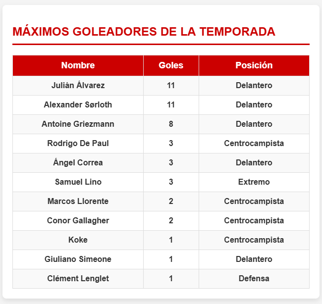

# Práctica 4: Creación APIrest

<a href="https://mrandy5.github.io/index.html#inicio" target="_blank">
    <button>Visita la web</button>
</a>

### Cambios introducidos:

1. **Creación APIres Goleadores**
   - He programado desde cero la APIrest que permite conocer los     goleadores del equipo.
   - Cada goleador tiene un nombre, posición y goles
   - Las operaciones que se pueden realizar son:
   - ## 🧪 Endpoints disponibles

| Método   | Endpoint                | Descripción                      | Body requerido |
|----------|-------------------------|----------------------------------|----------------|
| `POST`   | `/api/goleadores`       | Crear un nuevo goleador          | ✅ Sí           |
| `POST`   | `/api/goleadores/lote`  | Añade un lote de goleadores      | ✅ Sí           |
| `GET`    | `/api/goleadores`       | Obtener todos los goleadores     | ❌ No           |
| `GET`    | `/api/goleadores/{id}`  | Obtener un goleador por ID       | ❌ No           |
| `PUT`    | `/api/goleadores/{id}`  | Actualizar un goleador existente | ✅ Sí           |
| `DELETE` | `/api/goleadores/{id}`  | Eliminar un goleador por ID      | ❌ No           |

Para comprobar la implementación se deberá realizar un POST cada vez que se inicie la aplicación, usando postman se hará un post al: http://localhost:8081/api/goleadores/lote
El body deberá contener el siguiente texto:

[  { "nombre": "Julián Álvarez", "goles": 11, "posicion": "Delantero" },
  { "nombre": "Alexander Sørloth", "goles": 11, "posicion": "Delantero" },
  { "nombre": "Antoine Griezmann", "goles": 8, "posicion": "Delantero" },
  { "nombre": "Rodrigo De Paul", "goles": 3, "posicion": "Centrocampista" },
  { "nombre": "Ángel Correa", "goles": 3, "posicion": "Delantero" },
  { "nombre": "Samuel Lino", "goles": 3, "posicion": "Extremo" },
  { "nombre": "Marcos Llorente", "goles": 2, "posicion": "Centrocampista" },
  { "nombre": "Conor Gallagher", "goles": 2, "posicion": "Centrocampista" },
  { "nombre": "Koke", "goles": 1, "posicion": "Centrocampista" },
  { "nombre": "Giuliano Simeone", "goles": 1, "posicion": "Delantero" },
  { "nombre": "Clément Lenglet", "goles": 1, "posicion": "Defensa" }]

2. **Implementación**
   - Para introducir goleadores se utiliza postman
   - Se pueden ver los datos introducidos en http://localhost:8081/h2-console

3. **Despliegue Web**
   - Se ha implementado la API en la página web de prácticas anteriores, dentro de la página estádisticas bajo el título de goleadores Temporada 24/25

4. **Resultado**
-

